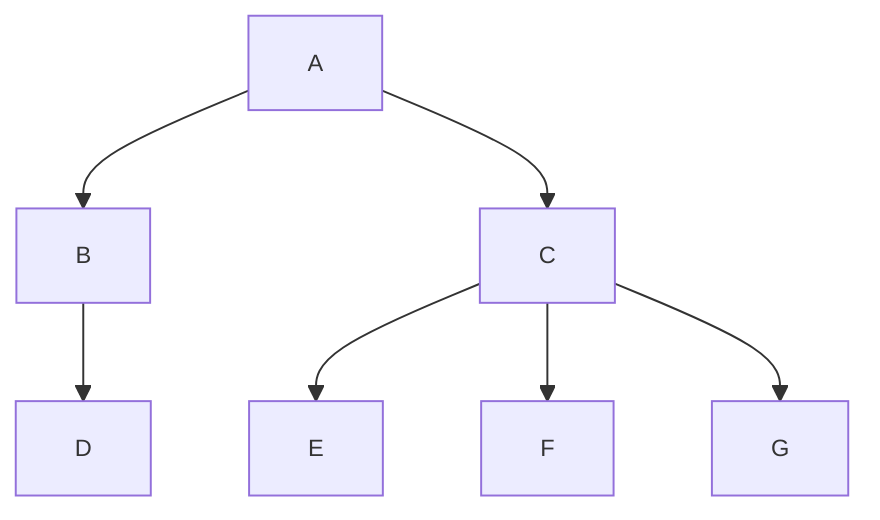

## General Terminology

**Tree**: A hierarchical data structure consisting of nodes connected by edges, with no cycles.

**Node**: A single element in a tree containing data and references to child nodes.

**Root**: The topmost node in a tree (the only node with no parent).

**Edge**: A connection between two nodes (parent-child relationship).

**Parent**: A node that has children below it.

**Child**: A node directly connected to another node when moving away from the root.

**Siblings**: Nodes that share the same parent.

**Leaf**: A node with no children. (aka External Node)

**Internal Node**: A node with at least one child.

**Ancestor**: Any node on the path from a given node to the root (including the root).

**Descendant**: Any node reachable by traversing down from a given node.

**Subtree**: A tree formed by a node and all its descendants.

**Path**: A sequence of nodes connected by edges.

**Level**: The distance from the root (root is level 0, its children are level 1, etc.).

**Height of a Node**: The length of the longest path from that node to a leaf.
- Height of a leaf = 0
- Height of a tree = height of its root

**Depth of a Node**: The length of the path from the root to that node.
- Depth of root = 0

**Degree of a Node**: The number of children a node has.

**Degree of a Tree**: The maximum degree of any node in the tree.

|   | Node          | Level | Depth | Height | Degree |
| - | ----          | ----- | ----- | ------ | ------ |
| A | Root          | 0     | 0     | 2      | 2      |
| B | Internal Node | 1     | 1     | 1      | 1      |
| C | Internal Node | 1     | 1     | 1      | 3      |
| D | Leaf          | 2     | 2     | 0      | 0      |
| E | Leaf          | 2     | 2     | 0      | 0      |
| F | Leaf          | 2     | 2     | 0      | 0      |
| G | Leaf          | 2     | 2     | 0      | 0      |

**This tree has degree 3** (ternary tree, since C has 3 children)