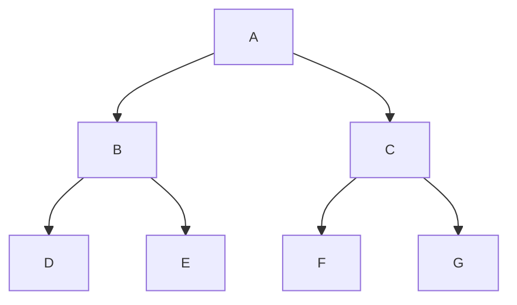

# Trees

## Binary Trees

### Terminology


**Binary Tree**: A tree where each node has at most two children (left and right).

**Left Child**: The child node on the left side.

**Right Child**: The child node on the right side.

### Structure
- **Full Binary Tree**: Every node has either 0 or 2 children (no nodes have exactly 1 child).

- **Complete Binary Tree**: All levels are completely filled except possibly the last level, which is filled from left to right.

- **Perfect Binary Tree**: All internal nodes have exactly 2 children, and all leaves are at the same level.

- **Balanced Binary Tree**: A tree where the height of left and right subtrees of any node differ by at most 1.

- **Degenerate Tree**: Each parent node has only one child, essentially forming a linked list. (aka **Pathological Tree**)

### Order
- **Binary Search Tree (BST)**: The left child value is always smaller than the parent value. The parent value is always smaller than the right child value. ```l < p < r```
- **Heap**: The parent value is always greater than or equal to the children values ```p >= c``` (max-heap) or the parent value is always less than or equal to the children values ```p <= c``` (min-heap). 

### Properties

- **Maximum nodes at level i**: 2<sup>i</sup> (where root is level 0)
- **Maximum nodes in a tree of height h**: 2<sup>h+1</sup> - 1
- **Minimum height for n nodes**: ⌈log<sub>2</sub>(n+1)⌉ - 1
- **Maximum height for n nodes**: n - 1 (degenerate case)

### Common Operations
*For generic (unordered) binary trees:*

| Operation | Description              | Time Complexity |
| --------- | -----------              | --------------- |
| Insert    | Add a new node to the tree          | O(n) |
| Delete    | Remove a node from the tree         | O(n) |
| Search    | Find a node with a specific value   | O(n) |
| Traverse  | Visit all nodes in a specific order | O(n) |

*BSTs and heaps have different time complexities due to their ordering properties.*

## Traversal Methods

**Depth-First Search (DFS)**:
- **Inorder** (Left ```→``` Root ```→``` Right): Used for getting sorted order in binary search trees
- **Preorder** (Root ```→``` Left ```→``` Right): Used for creating a copy of the tree (parent is processed before children)
- **Postorder** (Left ```→``` Right ```→``` Root): Used for deleting nodes (children are processed before parent)

**Breadth-First Search (BFS)**:
- **Level-order**: Visit nodes level by level from left to right
